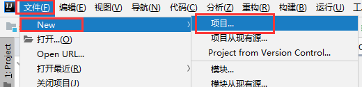
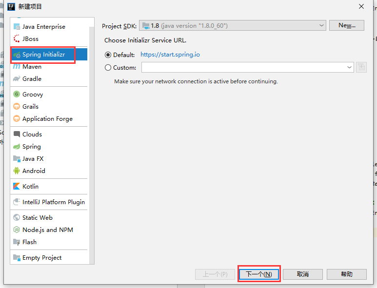
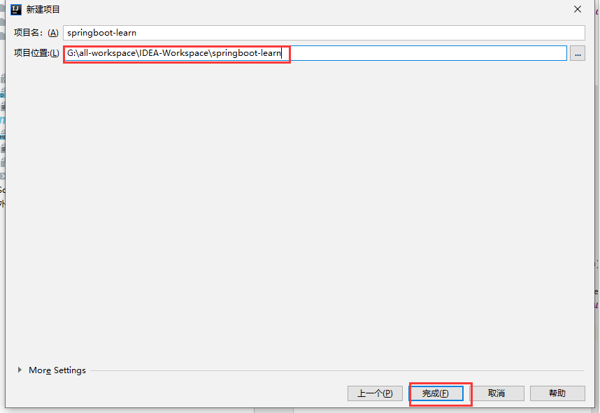
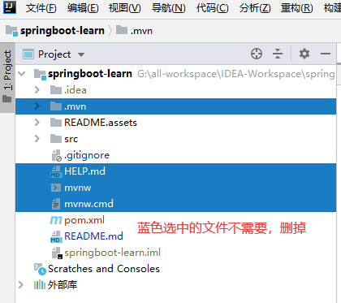
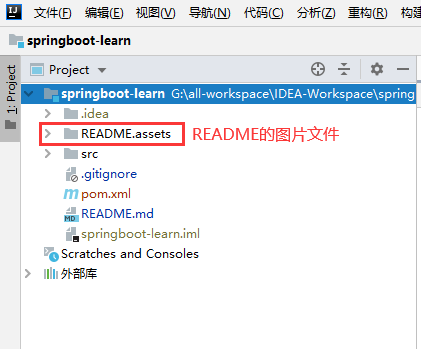
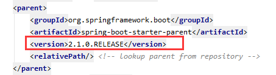
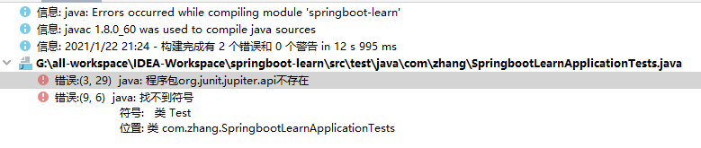
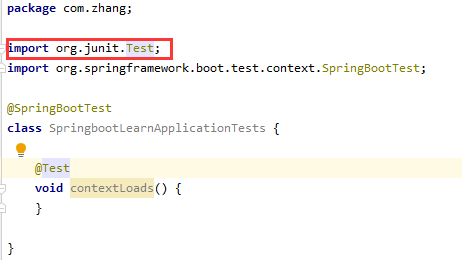
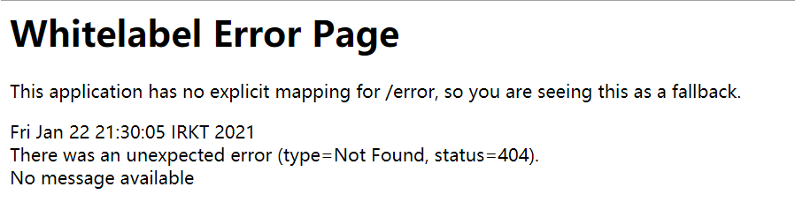

# springboot-learn

## 介绍
springboot 学习

## 新建springboot-learn项目

**新建父项目** `springboot-learn`

**然后把版本改成**`2.1.0`，因为高版本对其他的框架有不兼容的。

运行测试报错：

高版本的 单元测试包，和低版本的不是同一个。所以我们把 `test`包也改下

运行测试如图

服务已经开启。