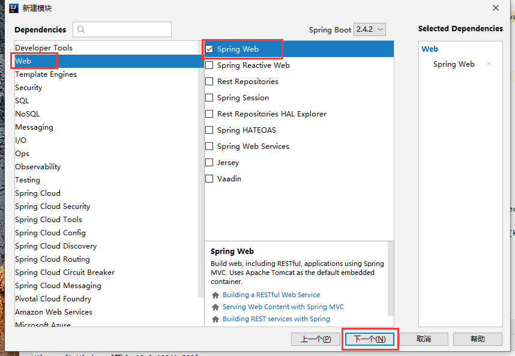

# springboot-learn

## 介绍
springboot 学习

# 新建 | 打开 springboot-learn 空项目

**我的代码是全部上传码云的，所以码云新建空项目，然后拉下来直接用idea打开。**

码云空项目


拉的空项目


`README.assets`是我用`Typora`编写`README.md`文件时生成的存放图片文件的目录。

用`IDEA`打开这个空项目


如图，就是一个空项目。


# SpringBoot 集成 RabbitMQ

## 服务器准备 docker-rabbitmq

```shell
# 一、获取镜像
# 	指定版本，该版本包含了web控制页面
docker pull rabbitmq:management

# 二、运行镜像
# 	方式一：默认guest 用户，密码也是 guest
docker run -d --hostname rabbitmq-learn --name rabbitmq-learn -p 15672:15672 -p 5672:5672 rabbitmq:management
# 	方式二：设置用户名和密码
docker run -d --hostname rabbitmq-learn --name rabbitmq-learn -e RABBITMQ_DEFAULT_USER=user -e  ABBITMQ_DEFAULT_PASS=password -p 15672:15672 -p 5672:5672 rabbitmq:management
# 三、访问ui页面
http://localhost:15672/
```

## 新建`rabbitmq-learn`模块


删除不必要的文件


删除后如图


## 引入依赖

```xml
<dependency>
    <groupId>org.springframework.boot</groupId>
    <artifactId>spring-boot-starter-amqp</artifactId>
</dependency>
```

## 配置文件

删除其他，然后新建配置文件：`application.yml`

配置如下

```yml
spring:
  rabbitmq:
    host: 106.54.139.107
    port: 5672
    username: guest
    password: guest
```

## 测试代码如下

新建测试类`src/test/java/com/zhang/test/TestRabbitMQ.java`

内容如下

```java
import com.zhang.RabbitmqLearnApplication;
import org.junit.Test;
import org.junit.runner.RunWith;
import org.springframework.amqp.rabbit.core.RabbitTemplate;
import org.springframework.beans.factory.annotation.Autowired;
import org.springframework.boot.test.context.SpringBootTest;
import org.springframework.test.context.junit4.SpringRunner;

/**
 * ClassName TestRabbitMQ
 * Description TODO 类描述
 *
 * @author ZhangRenjie
 * Date  2021/1/28 14:49
 */
@SpringBootTest(classes = RabbitmqLearnApplication.class)
@RunWith(SpringRunner.class)
public class TestRabbitMQ {

    @Autowired
    private RabbitTemplate rabbitTemplate;

    // hello world
    @Test
    public void testHello() {
        rabbitTemplate.convertAndSend("hello", "hello world");
    }

    // work 默认轮询
    @Test
    public void testWork() {
        for (int i = 0; i < 10; i++) {
            rabbitTemplate.convertAndSend("work", "work 模型"+i);
        }
    }

    // fanout 广播
    @Test
    public void testFanout() {
        rabbitTemplate.convertAndSend("logs", "", "Fanout 模型发送的消息");
    }

    // route 广播
    @Test
    public void testRoute() {
        rabbitTemplate.convertAndSend("directs", "info", "Route 模型发送的消息");
    }

    // topic 广播
    @Test
    public void testTopic() {
        rabbitTemplate.convertAndSend("topics", "user.save", "user.save 路由消息");
    }
}
```

响应的消费者类`src/main/java/com/zhang/hello/HelloCustomer.java`

```java
import org.springframework.amqp.rabbit.annotation.Queue;
import org.springframework.amqp.rabbit.annotation.RabbitHandler;
import org.springframework.amqp.rabbit.annotation.RabbitListener;
import org.springframework.stereotype.Component;

/**
 * ClassName HelloCustomer
 * Description TODO 类描述
 *
 * @author ZhangRenjie
 * Date  2021/1/28 14:53
 */
@Component
/*
@RabbitListener(queuesToDeclare = @Queue(value = "hello", durable = "false", autoDelete = "true"))

@RabbitListener 队列监听者 | 消费者
queuesToDeclare 配置队列信息，如果不存在则新建
value 队列名
durable 是否持久化
autoDelete 是否自动删除

默认创建的就是 持久化、非独占、不自动删除的队列
 */
@RabbitListener(queuesToDeclare = @Queue(value = "hello"))
public class HelloCustomer {

    @RabbitHandler
    public void receive1(String message) {
        System.out.println("---------------------hello---------------------");
        System.out.println("message = " + message);
    }
}
```

`src/main/java/com/zhang/work/WorkCustomer.java`

```java
import org.springframework.amqp.rabbit.annotation.Queue;
import org.springframework.amqp.rabbit.annotation.RabbitListener;
import org.springframework.stereotype.Component;

/**
 * ClassName WorkCustomer
 * Description TODO 类描述
 *
 * @author ZhangRenjie
 * Date  2021/1/28 16:33
 */
@Component
public class WorkCustomer {

    @RabbitListener(queuesToDeclare = @Queue("work"))
    public void receive1 (String message) {
        System.out.println("message1 = " + message);

    }

    @RabbitListener(queuesToDeclare = @Queue("work"))
    public void receive2 (String message) {
        System.out.println("message2 = " + message);

    }
}
```

`src/main/java/com/zhang/fanout/FanoutCustomer.java`

```java
import org.springframework.amqp.rabbit.annotation.Exchange;
import org.springframework.amqp.rabbit.annotation.Queue;
import org.springframework.amqp.rabbit.annotation.QueueBinding;
import org.springframework.amqp.rabbit.annotation.RabbitListener;
import org.springframework.stereotype.Component;

/**
 * ClassName FanoutCustomer
 * Description TODO 类描述
 *
 * @author ZhangRenjie
 * Date  2021/1/28 16:39
 */
@Component
public class FanoutCustomer {

    @RabbitListener(bindings = {
            @QueueBinding( // 将队列绑定到交换机
                    value = @Queue, // 不指定名称产生临时队列
                    exchange = @Exchange(value = "logs", type = "fanout") // 绑定的交换机
            )
    })
    public void receive1(String message) {
        System.out.println("message1 " + message);
    }

    @RabbitListener(bindings = {
            @QueueBinding( // 将队列绑定到交换机
                    value = @Queue, // 不指定名称产生临时队列
                    exchange = @Exchange(value = "logs", type = "fanout") // 绑定的交换机
            )
    })
    public void receive2(String message) {
        System.out.println("message2 " + message);
    }
}
```

`src/main/java/com/zhang/route/RouteCustomer.java`

```java
import org.springframework.amqp.rabbit.annotation.Exchange;
import org.springframework.amqp.rabbit.annotation.Queue;
import org.springframework.amqp.rabbit.annotation.QueueBinding;
import org.springframework.amqp.rabbit.annotation.RabbitListener;
import org.springframework.stereotype.Component;

/**
 * ClassName RouteCustomer
 * Description TODO 类描述
 *
 * @author ZhangRenjie
 * Date  2021/1/28 16:45
 */
@Component
public class RouteCustomer {
    @RabbitListener(bindings = {
            @QueueBinding( // 将队列绑定到交换机
                    value = @Queue, // 不指定名称产生临时队列
                    exchange = @Exchange(value = "directs", type = "direct"), // 绑定的交换机
                    key = {"info", "error", "warn"}
            )
    })
    public void receive1(String message) {
        System.out.println("message1 " + message);
    }

    @RabbitListener(bindings = {
            @QueueBinding( // 将队列绑定到交换机
                    value = @Queue, // 不指定名称产生临时队列
                    exchange = @Exchange(value = "directs", type = "direct"), // 绑定的交换机
                    key = {"error"}
            )
    })
    public void receive2(String message) {
        System.out.println("message2 " + message);
    }
}
```

`src/main/java/com/zhang/topic/TopicCustomer.java`

```java
import org.springframework.amqp.rabbit.annotation.Exchange;
import org.springframework.amqp.rabbit.annotation.Queue;
import org.springframework.amqp.rabbit.annotation.QueueBinding;
import org.springframework.amqp.rabbit.annotation.RabbitListener;
import org.springframework.stereotype.Component;

/**
 * ClassName TopicCustomer
 * Description TODO 类描述
 *
 * @author ZhangRenjie
 * Date  2021/1/28 16:50
 */
@Component
public class TopicCustomer {

    /*
    * 代表一个任意单词
    # 代表任意个数、任意单词
     */

    @RabbitListener(bindings = {
            @QueueBinding( // 将队列绑定到交换机
                    value = @Queue, // 不指定名称产生临时队列
                    exchange = @Exchange(type = "direct", name = "topics"), // 绑定的交换机
                    key = {"user.save", "user.*"}
            )
    })
    public void receive1(String message) {
        System.out.println("message1 " + message);
    }

    @RabbitListener(bindings = {
            @QueueBinding( // 将队列绑定到交换机
                    value = @Queue, // 不指定名称产生临时队列
                    exchange = @Exchange(type = "direct", name = "topics"), // 绑定的交换机
                    key = {"order.#", "produce.#", "user.*"}
            )
    })
    public void receive2(String message) {
        System.out.println("message2 " + message);
    }
}
```

# SpringBoot 集成 Knife4j

记住一点， knife4j 是 swagger2 的增强，除了引入的配置不一样，起来大同小异。

## 新建`knife4j-learn`模块


下边红框选中的是不需要的依赖项，删除


删除后如图


## 引入依赖

```xml
<!--knife4j start-->
<dependency>
    <groupId>com.github.xiaoymin</groupId>
    <artifactId>knife4j-spring-boot-starter</artifactId>
    <version>2.0.4</version>
</dependency>
<!--knife4j end-->
<!-- Lombok start-->
<dependency>
    <groupId>org.projectlombok</groupId>
    <artifactId>lombok</artifactId>
    <version>1.18.12</version>
</dependency>
<!--lombok end-->
```

添加配置文件`src/main/java/com/zhang/config/Knife4jConfiguration.java`

```java
import com.github.xiaoymin.knife4j.spring.annotations.EnableKnife4j;
import org.springframework.context.annotation.Bean;
import org.springframework.context.annotation.Configuration;
import springfox.documentation.builders.RequestHandlerSelectors;
import springfox.documentation.service.ApiInfo;
import springfox.documentation.service.Contact;
import springfox.documentation.spi.DocumentationType;
import springfox.documentation.spring.web.plugins.Docket;
import springfox.documentation.swagger2.annotations.EnableSwagger2;

import java.util.ArrayList;

/**
 * ClassName Knife4jConfiguration
 * Description TODO 类描述
 *
 * @author ZhangRenjie
 * Date  2021/1/28 20:46
 */
@Configuration
@EnableSwagger2
@EnableKnife4j
public class Knife4jConfiguration {
    // 配置swagger的“我要瘦成一道闪电”分组的Docket实例
    @Bean
    public Docket docket1(){
        return new Docket(DocumentationType.SWAGGER_2)
                .apiInfo(apiInfo())
                // 配置分组名称
                .groupName("我要瘦成一道闪电")
                /*
                配置是否启用swagger，默认true
                启用
                .enable(true)
                不启用
                .enable(false)
                */
                .select()
                /*
                可以不配置，不配置时，扫描全部。
                配置扫描包：
                必须在 .select()和 .build()之间配置
                一、配置扫描路径
                    1. 配置指定扫描的包——最常用
                    .apis(RequestHandlerSelectors.basePackage("com.test.sprinbootswagger2.controller"))
                    2. 扫描全部
                    .apis(RequestHandlerSelectors.any())
                    3. 都不扫描
                    .apis(RequestHandlerSelectors.none())
                    4. 扫描类上有XX注解的类（以@RestController注解为例）
                    .apis(RequestHandlerSelectors.withClassAnnotation(RestController.class))
                    5. 扫描方法上有XX注解的类（以@GetMapping注解为例）
                    .apis(RequestHandlerSelectors.withClassAnnotation(GetMapping.class))
                二、配置过滤路径，优先级比上边的高
                    1. 不扫描某路径
                    .paths(PathSelectors.ant("/test/**"))
                    2. 其他类似上边any、none、regex等
                */
                //
                .apis(RequestHandlerSelectors.basePackage("com.test.sprinbootswagger2.controller"))
                .build();
    }

    // 配置swagger的Docket实例
    @Bean
    public Docket docket2(){
        return new Docket(DocumentationType.SWAGGER_2)
                // 配置分组名称
                .groupName("A");
    }
    // 配置swagger的Docket实例
    @Bean
    public Docket docket3(){
        return new Docket(DocumentationType.SWAGGER_2)
                // 配置分组名称
                .groupName("B");
    }

    // 配置Swagger“我想做阿信”分组的信息=apiInfo
    private ApiInfo apiInfo() {
        Contact contact = new Contact("我想做阿信","https://blog.csdn.net/qq_42909053/","1273206268@qq.com");
        // 作者信息
        return new ApiInfo(
                "Spring Boot 整合 Knife4j 接口文档",
                "# Spring Boot 整合 Knife4j 接口文档 APIs",
                "v1.0",
                "https://blog.csdn.net/qq_42909053/article/details/104982904",
                contact,
                "Apache 2.0",
                "http://www.apache.org/licenses/LICENSE-2.0",
                new ArrayList<>()
        );
    }

}
```

其余的是业务逻辑，记住方法、类、变量上边添加Swagger的注解就行。

## 结果如图

## 使用教程

具体使用推荐一篇博客，这里不再赘述

[SpringBoot整合knife4j](https://www.cnblogs.com/dalianpai/p/11967669.html)


# SpringBoot 集成 Redis

## 服务器准备 docker-redis

```shell
# 下载redis镜像
docker pull redis
# 启动redis
docker run -d --name xiaoyun_redis -p 6379:6379 redis
```

## 新建`redis-learn`模块


上图红框选中的，是现阶段用不到的，直接先干掉，干掉后如图：


## 引入依赖

```xml
<!--redis start-->
<dependency>
    <groupId>org.springframework.boot</groupId>
    <artifactId>spring-boot-starter-data-redis</artifactId>
</dependency>
<!--redis end-->

<!--lombok start-->
<dependency>
    <groupId>org.projectlombok</groupId>
    <artifactId>lombok</artifactId>
    <version>1.18.8</version>
</dependency>
<!--lombok end-->
```

## 配置链接信息

```yml
spring:
  redis:
    host: 106.54.139.107
    port: 6379
```

## RedisTemplate 测试

`RedisLearnApplicationTests`

```java
import com.fasterxml.jackson.core.JsonProcessingException;
import com.fasterxml.jackson.databind.ObjectMapper;
import com.zhang.pojo.User;
import org.junit.jupiter.api.Test;
import org.springframework.beans.factory.annotation.Autowired;
import org.springframework.boot.test.context.SpringBootTest;
import org.springframework.data.redis.core.RedisTemplate;

@SpringBootTest
class RedisLearnApplicationTests {

    @Autowired
    private RedisTemplate redisTemplate;


    /*
     redisTemplate    操作不同的数据类型，qpi 和我们的指令是一样的
     opsForXX         操作XX类型的数据
     opsForValue      操作字符串   类似String
     opsForList
     opsForSet
     opsForHash
     opsForZSet
     opsForGeo（地图）
     opsForHyperLogLog
     */

    @Test
    void testRedisTemplate() {
        redisTemplate.opsForValue().set("test", "123");
        System.out.println(redisTemplate.opsForValue().get("test"));
    }

    @Test
    void testSavePojo() throws JsonProcessingException {
        User user = new User("test", 3);
        // Jackson 序列化对象为Json
        String jsonUser = new ObjectMapper().writeValueAsString(user);
        redisTemplate.opsForValue().set("user", jsonUser);
        System.out.println(redisTemplate.opsForValue().get("user"));
    }
}
```

## 自定义RedisTemplate

`RedisConfig`

```java
import com.fasterxml.jackson.annotation.JsonAutoDetect;
import com.fasterxml.jackson.annotation.PropertyAccessor;
import com.fasterxml.jackson.databind.ObjectMapper;
import org.springframework.context.annotation.Bean;
import org.springframework.context.annotation.Configuration;
import org.springframework.data.redis.connection.RedisConnectionFactory;
import org.springframework.data.redis.core.RedisTemplate;
import org.springframework.data.redis.serializer.Jackson2JsonRedisSerializer;
import org.springframework.data.redis.serializer.StringRedisSerializer;

/**
 * ClassName RedisConfig
 * Description TODO 类描述
 *
 * @author ZhangRenjie
 * Date  2021/2/1 10:59
 */
@Configuration
public class RedisConfig {

    // 自定义 ResisTemplate，基本是固定模板
    @Bean
    @SuppressWarnings("all")
    public RedisTemplate<String, Object> redisTemplate(RedisConnectionFactory redisConnectionFactory) {
        // 方法是从org.springframework.boot.autoconfigure.data.redis.RedisAutoConfiguration 直接复制过来，改了点东西
        RedisTemplate<String, Object> template = new RedisTemplate<>();
        template.setConnectionFactory(redisConnectionFactory);
        
        // Json序列化配置
        Jackson2JsonRedisSerializer jackson2JsonRedisSerializer = new Jackson2JsonRedisSerializer(Object.class);
        ObjectMapper om = new ObjectMapper();
        om.setVisibility(PropertyAccessor.ALL, JsonAutoDetect.Visibility.ANY);
        om.enableDefaultTyping(ObjectMapper.DefaultTyping.NON_FINAL);
        jackson2JsonRedisSerializer.setObjectMapper(om);
        // String 的序列化
        StringRedisSerializer stringRedisSerializer = new StringRedisSerializer();

        // key采用String的序列化方式
        template.setKeySerializer(stringRedisSerializer);
        // hash的key也采用String的序列化方式
        template.setHashKeySerializer(stringRedisSerializer);
        // value序列化方式采用jackson
        template.setValueSerializer(jackson2JsonRedisSerializer);
        // hash的value序列化方式采用jackson
        template.setHashValueSerializer(jackson2JsonRedisSerializer);
        template.afterPropertiesSet();

        return template;
    }
}
```

**实体类**

`User`

```java
import lombok.AllArgsConstructor;
import lombok.Data;
import lombok.NoArgsConstructor;
import org.springframework.stereotype.Component;

/**
 * ClassName User
 * Description TODO 类描述
 *
 * @author ZhangRenjie
 * Date  2021/2/1 11:08
 */
@Component
@AllArgsConstructor
@NoArgsConstructor
@Data
public class User {

    private String name;
    private int age;
}
```

**测试**

`MyRedisTemplateTest`

```java
import com.fasterxml.jackson.core.JsonProcessingException;
import com.zhang.pojo.User;
import org.junit.jupiter.api.Test;
import org.springframework.beans.factory.annotation.Autowired;
import org.springframework.beans.factory.annotation.Qualifier;
import org.springframework.boot.test.context.SpringBootTest;
import org.springframework.data.redis.core.RedisTemplate;

/**
 * ClassName MyRedisTemplateTest
 * Description TODO 类描述
 *
 * @author ZhangRenjie
 * Date  2021/2/1 11:39
 */
@SpringBootTest
public class MyRedisTemplateTest {

    @Autowired
    @Qualifier("redisTemplate") // 重名后，设置用户名，引入的是自己配置的 RedisTemplate
    private RedisTemplate redisTemplate;

    @Test
    void testRedisTemplate() {
        redisTemplate.opsForValue().set("test", "123");
        System.out.println(redisTemplate.opsForValue().get("test"));
    }

    @Test
    void testSavePojo() throws JsonProcessingException {
        User user = new User("test", 3);
        // 自定义的RedisTemplate配置了实体类等一系列数据类型的序列化方式
        redisTemplate.opsForValue().set("user", user);
        System.out.println(redisTemplate.opsForValue().get("user"));
    }

}
```


## 封装工具类

`RedisUtil`

```java
import org.springframework.beans.factory.annotation.Autowired;
import org.springframework.data.redis.core.RedisTemplate;
import org.springframework.stereotype.Component;
import org.springframework.util.CollectionUtils;

import java.util.Collection;
import java.util.List;
import java.util.Map;
import java.util.Set;
import java.util.concurrent.TimeUnit;

/**
 * ClassName RedisUtil
 * Description TODO 类描述：真是开发中，不可能和测试类那样去自己一步步写，会封装一个工具类，供大家使用，这个工具类，是从狂神哪里复制的，还没细看。。
 *
 * @author ZhangRenjie
 * Date  2021/2/1 11:49
 */
@Component
public final class RedisUtil {

    @Autowired
    private RedisTemplate<String, Object> redisTemplate;

    // =============================common============================
    /**
     * 指定缓存失效时间
     * @param key  键
     * @param time 时间(秒)
     */
    public boolean expire(String key, long time) {
        try {
            if (time > 0) {
                redisTemplate.expire(key, time, TimeUnit.SECONDS);
            }
            return true;
        } catch (Exception e) {
            e.printStackTrace();
            return false;
        }
    }

    /**
     * 根据key 获取过期时间
     * @param key 键 不能为null
     * @return 时间(秒) 返回0代表为永久有效
     */
    public long getExpire(String key) {
        return redisTemplate.getExpire(key, TimeUnit.SECONDS);
    }


    /**
     * 判断key是否存在
     * @param key 键
     * @return true 存在 false不存在
     */
    public boolean hasKey(String key) {
        try {
            return redisTemplate.hasKey(key);
        } catch (Exception e) {
            e.printStackTrace();
            return false;
        }
    }


    /**
     * 删除缓存
     * @param key 可以传一个值 或多个
     */
    @SuppressWarnings("unchecked")
    public void del(String... key) {
        if (key != null && key.length > 0) {
            if (key.length == 1) {
                redisTemplate.delete(key[0]);
            } else {
                redisTemplate.delete((Collection<String>) CollectionUtils.arrayToList(key));
            }
        }
    }


    // ============================String=============================

    /**
     * 普通缓存获取
     * @param key 键
     * @return 值
     */
    public Object get(String key) {
        return key == null ? null : redisTemplate.opsForValue().get(key);
    }

    /**
     * 普通缓存放入
     * @param key   键
     * @param value 值
     * @return true成功 false失败
     */

    public boolean set(String key, Object value) {
        try {
            redisTemplate.opsForValue().set(key, value);
            return true;
        } catch (Exception e) {
            e.printStackTrace();
            return false;
        }
    }


    /**
     * 普通缓存放入并设置时间
     * @param key   键
     * @param value 值
     * @param time  时间(秒) time要大于0 如果time小于等于0 将设置无限期
     * @return true成功 false 失败
     */

    public boolean set(String key, Object value, long time) {
        try {
            if (time > 0) {
                redisTemplate.opsForValue().set(key, value, time, TimeUnit.SECONDS);
            } else {
                set(key, value);
            }
            return true;
        } catch (Exception e) {
            e.printStackTrace();
            return false;
        }
    }


    /**
     * 递增
     * @param key   键
     * @param delta 要增加几(大于0)
     */
    public long incr(String key, long delta) {
        if (delta < 0) {
            throw new RuntimeException("递增因子必须大于0");
        }
        return redisTemplate.opsForValue().increment(key, delta);
    }


    /**
     * 递减
     * @param key   键
     * @param delta 要减少几(小于0)
     */
    public long decr(String key, long delta) {
        if (delta < 0) {
            throw new RuntimeException("递减因子必须大于0");
        }
        return redisTemplate.opsForValue().increment(key, -delta);
    }


    // ================================Map=================================

    /**
     * HashGet
     * @param key  键 不能为null
     * @param item 项 不能为null
     */
    public Object hget(String key, String item) {
        return redisTemplate.opsForHash().get(key, item);
    }

    /**
     * 获取hashKey对应的所有键值
     * @param key 键
     * @return 对应的多个键值
     */
    public Map<Object, Object> hmget(String key) {
        return redisTemplate.opsForHash().entries(key);
    }

    /**
     * HashSet
     * @param key 键
     * @param map 对应多个键值
     */
    public boolean hmset(String key, Map<String, Object> map) {
        try {
            redisTemplate.opsForHash().putAll(key, map);
            return true;
        } catch (Exception e) {
            e.printStackTrace();
            return false;
        }
    }


    /**
     * HashSet 并设置时间
     * @param key  键
     * @param map  对应多个键值
     * @param time 时间(秒)
     * @return true成功 false失败
     */
    public boolean hmset(String key, Map<String, Object> map, long time) {
        try {
            redisTemplate.opsForHash().putAll(key, map);
            if (time > 0) {
                expire(key, time);
            }
            return true;
        } catch (Exception e) {
            e.printStackTrace();
            return false;
        }
    }


    /**
     * 向一张hash表中放入数据,如果不存在将创建
     *
     * @param key   键
     * @param item  项
     * @param value 值
     * @return true 成功 false失败
     */
    public boolean hset(String key, String item, Object value) {
        try {
            redisTemplate.opsForHash().put(key, item, value);
            return true;
        } catch (Exception e) {
            e.printStackTrace();
            return false;
        }
    }

    /**
     * 向一张hash表中放入数据,如果不存在将创建
     *
     * @param key   键
     * @param item  项
     * @param value 值
     * @param time  时间(秒) 注意:如果已存在的hash表有时间,这里将会替换原有的时间
     * @return true 成功 false失败
     */
    public boolean hset(String key, String item, Object value, long time) {
        try {
            redisTemplate.opsForHash().put(key, item, value);
            if (time > 0) {
                expire(key, time);
            }
            return true;
        } catch (Exception e) {
            e.printStackTrace();
            return false;
        }
    }


    /**
     * 删除hash表中的值
     *
     * @param key  键 不能为null
     * @param item 项 可以使多个 不能为null
     */
    public void hdel(String key, Object... item) {
        redisTemplate.opsForHash().delete(key, item);
    }


    /**
     * 判断hash表中是否有该项的值
     *
     * @param key  键 不能为null
     * @param item 项 不能为null
     * @return true 存在 false不存在
     */
    public boolean hHasKey(String key, String item) {
        return redisTemplate.opsForHash().hasKey(key, item);
    }


    /**
     * hash递增 如果不存在,就会创建一个 并把新增后的值返回
     *
     * @param key  键
     * @param item 项
     * @param by   要增加几(大于0)
     */
    public double hincr(String key, String item, double by) {
        return redisTemplate.opsForHash().increment(key, item, by);
    }


    /**
     * hash递减
     *
     * @param key  键
     * @param item 项
     * @param by   要减少记(小于0)
     */
    public double hdecr(String key, String item, double by) {
        return redisTemplate.opsForHash().increment(key, item, -by);
    }


    // ============================set=============================

    /**
     * 根据key获取Set中的所有值
     * @param key 键
     */
    public Set<Object> sGet(String key) {
        try {
            return redisTemplate.opsForSet().members(key);
        } catch (Exception e) {
            e.printStackTrace();
            return null;
        }
    }


    /**
     * 根据value从一个set中查询,是否存在
     *
     * @param key   键
     * @param value 值
     * @return true 存在 false不存在
     */
    public boolean sHasKey(String key, Object value) {
        try {
            return redisTemplate.opsForSet().isMember(key, value);
        } catch (Exception e) {
            e.printStackTrace();
            return false;
        }
    }


    /**
     * 将数据放入set缓存
     *
     * @param key    键
     * @param values 值 可以是多个
     * @return 成功个数
     */
    public long sSet(String key, Object... values) {
        try {
            return redisTemplate.opsForSet().add(key, values);
        } catch (Exception e) {
            e.printStackTrace();
            return 0;
        }
    }


    /**
     * 将set数据放入缓存
     *
     * @param key    键
     * @param time   时间(秒)
     * @param values 值 可以是多个
     * @return 成功个数
     */
    public long sSetAndTime(String key, long time, Object... values) {
        try {
            Long count = redisTemplate.opsForSet().add(key, values);
            if (time > 0) {
                expire(key, time);
            }
            return count;
        } catch (Exception e) {
            e.printStackTrace();
            return 0;
        }
    }


    /**
     * 获取set缓存的长度
     *
     * @param key 键
     */
    public long sGetSetSize(String key) {
        try {
            return redisTemplate.opsForSet().size(key);
        } catch (Exception e) {
            e.printStackTrace();
            return 0;
        }
    }


    /**
     * 移除值为value的
     *
     * @param key    键
     * @param values 值 可以是多个
     * @return 移除的个数
     */

    public long setRemove(String key, Object... values) {
        try {
            Long count = redisTemplate.opsForSet().remove(key, values);
            return count;
        } catch (Exception e) {
            e.printStackTrace();
            return 0;
        }
    }

    // ===============================list=================================

    /**
     * 获取list缓存的内容
     *
     * @param key   键
     * @param start 开始
     * @param end   结束 0 到 -1代表所有值
     */
    public List<Object> lGet(String key, long start, long end) {
        try {
            return redisTemplate.opsForList().range(key, start, end);
        } catch (Exception e) {
            e.printStackTrace();
            return null;
        }
    }


    /**
     * 获取list缓存的长度
     *
     * @param key 键
     */
    public long lGetListSize(String key) {
        try {
            return redisTemplate.opsForList().size(key);
        } catch (Exception e) {
            e.printStackTrace();
            return 0;
        }
    }


    /**
     * 通过索引 获取list中的值
     *
     * @param key   键
     * @param index 索引 index>=0时， 0 表头，1 第二个元素，依次类推；index<0时，-1，表尾，-2倒数第二个元素，依次类推
     */
    public Object lGetIndex(String key, long index) {
        try {
            return redisTemplate.opsForList().index(key, index);
        } catch (Exception e) {
            e.printStackTrace();
            return null;
        }
    }


    /**
     * 将list放入缓存
     *
     * @param key   键
     * @param value 值
     */
    public boolean lSet(String key, Object value) {
        try {
            redisTemplate.opsForList().rightPush(key, value);
            return true;
        } catch (Exception e) {
            e.printStackTrace();
            return false;
        }
    }


    /**
     * 将list放入缓存
     * @param key   键
     * @param value 值
     * @param time  时间(秒)
     */
    public boolean lSet(String key, Object value, long time) {
        try {
            redisTemplate.opsForList().rightPush(key, value);
            if (time > 0) {
                expire(key, time);
            }
            return true;
        } catch (Exception e) {
            e.printStackTrace();
            return false;
        }

    }


    /**
     * 将list放入缓存
     *
     * @param key   键
     * @param value 值
     * @return
     */
    public boolean lSet(String key, List<Object> value) {
        try {
            redisTemplate.opsForList().rightPushAll(key, value);
            return true;
        } catch (Exception e) {
            e.printStackTrace();
            return false;
        }

    }


    /**
     * 将list放入缓存
     *
     * @param key   键
     * @param value 值
     * @param time  时间(秒)
     * @return
     */
    public boolean lSet(String key, List<Object> value, long time) {
        try {
            redisTemplate.opsForList().rightPushAll(key, value);
            if (time > 0) {
                expire(key, time);
            }
            return true;
        } catch (Exception e) {
            e.printStackTrace();
            return false;
        }
    }


    /**
     * 根据索引修改list中的某条数据
     *
     * @param key   键
     * @param index 索引
     * @param value 值
     * @return
     */

    public boolean lUpdateIndex(String key, long index, Object value) {
        try {
            redisTemplate.opsForList().set(key, index, value);
            return true;
        } catch (Exception e) {
            e.printStackTrace();
            return false;
        }
    }


    /**
     * 移除N个值为value
     *
     * @param key   键
     * @param count 移除多少个
     * @param value 值
     * @return 移除的个数
     */

    public long lRemove(String key, long count, Object value) {
        try {
            Long remove = redisTemplate.opsForList().remove(key, count, value);
            return remove;
        } catch (Exception e) {
            e.printStackTrace();
            return 0;
        }

    }

}
```


# SpringBoot 集成 Security

## 新建`security-learn`模块





红框选中的，是暂时不需要的，干掉


干掉后如图：


## 导入静态资源

```
welcome.html
|views
|level1
        1.html
        2.html
        3.html
|level2
        1.html
        2.html
        3.html
|level3
        1.html
        2.html
        3.html
Login.html
```

## 引入依赖

```xml
<!--thymeleaf-extras-springsecurity4 starrt-->
<!--有了这个整合包，可以在thymeaf中写一些security的操作-->
<!--使用的时候会报错，springboot 版本太高，最高支持2.0.9，但是2.0.9 UI 丑，而且 junit  都变了-->
<dependency>
    <groupId>org.thymeleaf.extras</groupId>
    <artifactId>thymeleaf-extras-springsecurity4</artifactId>
    <version>3.0.4.RELEASE</version>
</dependency>
<!--thymeleaf-extras-springsecurity4 end-->
<!--thymeleaf-spring5 start-->
<dependency>
    <groupId>org.thymeleaf</groupId>
    <artifactId>thymeleaf-spring5</artifactId>
</dependency>
<!--thymeleaf-spring5 end-->
<!--thymeleaf-extras-java8time start-->
<dependency>
    <groupId>org.thymeleaf.extras</groupId>
    <artifactId>thymeleaf-extras-java8time</artifactId>
</dependency>
<!--thymeleaf-extras-java8time end-->
<!--security start-->
<dependency>
    <groupId>org.springframework.boot</groupId>
    <artifactId>spring-boot-starter-security</artifactId>
</dependency>
<!--security end-->
```

核心是`security`包，其他包是辅助测试包

## 配置文件

`application.yml`

```yaml
# 关闭模板引擎缓存
spring:
  thymeleaf:
    cache: false
```

## 配置类SecurityConfig

```java
import org.springframework.security.config.annotation.authentication.builders.AuthenticationManagerBuilder;
import org.springframework.security.config.annotation.web.builders.HttpSecurity;
import org.springframework.security.config.annotation.web.configuration.EnableWebSecurity;
import org.springframework.security.config.annotation.web.configuration.WebSecurityConfigurerAdapter;
import org.springframework.security.crypto.bcrypt.BCryptPasswordEncoder;

/**
 * ClassName SecurityConfig
 * Description TODO 类描述
 *
 * @author ZhangRenjie
 * Date  2021/2/1 16:30
 */
@EnableWebSecurity
public class SecurityConfig extends WebSecurityConfigurerAdapter {
    // 授权
    @Override
    protected void configure(HttpSecurity http) throws Exception {
        // 配置首页所有人可访问，功能也只有对应权限的人才能访问
        http.authorizeRequests()
                .antMatchers("/").permitAll()
                .antMatchers("/level1/**").hasRole("vip1")
                .antMatchers("/level2/**").hasRole("vip2")
                .antMatchers("/level3/**").hasRole("vip3");

        // 防止网站攻击 csrf
        http.csrf().disable();
        // 配置没有权限跳转登录页
        http.formLogin();
        // 开启注销，并跳到昼夜
        http.logout().logoutSuccessUrl("/");

        // 开启记住我，自定义接收参数
        http.rememberMe().rememberMeParameter("remember");

        // 定制登录页
        http.formLogin().loginPage("/toLogin").usernameParameter("user").passwordParameter("pwd").loginProcessingUrl("/login");
    }

    /*
    认证
    springboot 2.1.X 可以直接使用
    大版本，报错，在 Security 5.0+ 增加了很多加密方式
     */
    @Override
    protected void configure(AuthenticationManagerBuilder auth) throws Exception {
        auth.inMemoryAuthentication().passwordEncoder(new BCryptPasswordEncoder())
                .withUser("test")
                .password(new BCryptPasswordEncoder().encode("123456"))
                .roles("vip1","vip2")
                .and()
                .withUser("admin")
                .password(new BCryptPasswordEncoder().encode("123456"))
                .roles("vip1","vip2", "vip3");
    }
}
```

## 控制器

`RouterController`

```java
import org.springframework.stereotype.Controller;
import org.springframework.web.bind.annotation.PathVariable;
import org.springframework.web.bind.annotation.RequestMapping;

/**
 * ClassName RouterController
 * Description TODO 类描述：跳转路由
 *
 * @author ZhangRenjie
 * Date  2021/2/1 15:30
 */
@Controller
public class RouterController {

    @RequestMapping({"/", "/index"})
    public String index() {
        return "index";
    }

    @RequestMapping("/toLogin")
    public String toLogin() {
        return "views/login";
    }

    @RequestMapping("/level1/{id}")
    public String level1(@PathVariable("id") int id) {
        return "views/level1/" + id;
    }

    @RequestMapping("/level2/{id}")
    public String level2(@PathVariable("id") int id) {
        return "views/level2/" + id;
    }

    @RequestMapping("/level3/{id}")
    public String level3(@PathVariable("id") int id) {
        return "views/level3/" + id;
    }
}
```


# end